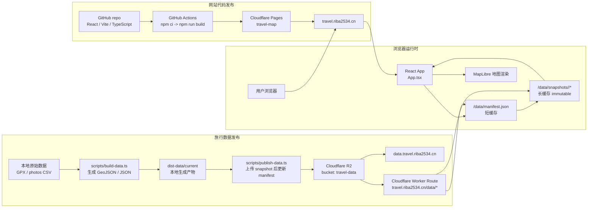

# Travel Map

把 GPX 轨迹数据渲染成一张深色沉浸式的世界地图。可以自由缩放，每一个点都能看到。

> 在线访问：<https://travel.riba2534.cn>

---

## 功能

- **全屏深色矢量地图**：OpenFreeMap dark 风格 + 强制 `name:zh-Hans` 中文标签
- **多缩放层级展示**：
  - 远视图：暖橙色发光的聚类气泡（含点数标签）
  - 近视图：单点 4px 发光圆点 + 点击 popup（UTC 时间 / 坐标 / 海拔）
- **轨迹线**：青色半透明 MultiLineString（按 30 分钟时间间隔切段，避免画跨洋飞行直线）
- **年份双滑块**：拉动毫秒级响应，setData 重新聚类
- **模式切换**：点位 / 热力图
- **高频城市卡**：点击 flyTo 城市中心
- **统计 KPI**：足迹点数 / 国家数 / 公里数 / 年份数
- **响应式**：PC + 移动端（≥44px 触控目标 + safe-area + 浮窗 backdrop-blur）

---

## 技术栈

| 层 | 选型 |
|---|---|
| 构建 | Vite 5 + React 18 + TypeScript |
| 地图引擎 | MapLibre GL JS 4（WebGL，原生 supercluster） |
| 矢量瓦片 | [OpenFreeMap](https://openfreemap.org) dark（免费、无 key、无限速） |
| 兜底瓦片 | CartoDB DarkMatter raster |
| GPX 解析 | 正则流式解析（构建时） |
| 轨迹简化 | simplify-js（tolerance 0.0001，~11m） |
| 国家识别 | world-atlas 50m + @turf/boolean-point-in-polygon |
| 距离计算 | @turf/length |
| 样式 | Tailwind CSS 3 + 5 个 CSS variable |
| 字体 | Inter（UI）+ JetBrains Mono（数字） |
| 网站部署 | Cloudflare Pages（自动 HTTPS + 全球 CDN） |
| 数据托管 | Cloudflare R2 自定义域名 `data.travel.riba2534.cn` |
| CI/CD | GitHub Actions（push main 自动部署网站；数据单独发布） |

---

## 架构

网站代码和旅行数据是两条独立发布链路。代码发布只更新 Cloudflare Pages 上的 React/Vite 静态站；数据发布只更新 Cloudflare R2 上的版本化 snapshot 和 `manifest.json`。生产环境通过 Worker 路由把 `travel.riba2534.cn/data/*` 反代到 R2，浏览器只访问同源 URL；本地开发默认直接读取 `data.travel.riba2534.cn`。



数据文件发布时遵循原子更新顺序：先上传 `snapshots/<version>/` 下的四个文件，全部成功后最后覆盖 `manifest.json`。因此线上用户要么读到旧版本，要么读到新版本，不会读到半套数据。

缓存策略：

| 路径 | 缓存策略 | 原因 |
|---|---|---|
| `manifest.json` | `public, max-age=60, must-revalidate` | 快速切换当前数据版本 |
| `snapshots/<version>/*` | `public, max-age=31536000, immutable` | 文件路径带版本，内容不可变，可长期缓存 |

---

## 项目结构

```
travel/
├── raw/                       # 原始 GPX/CSV（gitignored，本地保留）
├── dist-data/current/         # 本地生成数据（gitignored，仅用于发布前检查）
├── scripts/
│   ├── build-data.ts          # GPX/CSV → points/track/summary/places
│   ├── publish-data.ts        # 上传数据 snapshot + manifest 到 R2
│   └── known-cities.ts        # 已知城市目录（用于命名网格中心）
├── workers/
│   └── travel-data-worker.js  # /data/* → R2 的同源 Worker
├── src/
│   ├── main.tsx
│   ├── App.tsx                # manifest 数据加载 + 全局布局
│   ├── Map.tsx                # MapLibre 实例、所有图层、交互
│   ├── components/
│   │   ├── Header.tsx         # 左上：标题 + 统计（合并）
│   │   ├── PlacesMenu.tsx     # 右上：国家/城市筛选
│   │   ├── YearSlider.tsx     # 底部：年份双滑块 + 直方图
│   │   └── LayerToggles.tsx   # 底左：点位 / 热力 / 轨迹开关
│   ├── lib/
│   │   ├── types.ts
│   │   ├── data-manifest.ts   # R2 manifest 解析
│   │   └── mapStyle.ts        # 拉 OpenFreeMap 风格 + 强制中文化
│   └── styles/globals.css
├── .github/workflows/deploy.yml  # GitHub Actions
├── index.html                 # preconnect 数据域名 + 地图/字体域名
├── tailwind.config.js
└── vite.config.ts             # brotli + gzip 压缩 + maplibre 单独 chunk
```

---

## 本地开发

```bash
# 1. 安装依赖
npm install

# 2. 启动 dev server
# 生产读取 /data/manifest.json；本地默认读取 https://data.travel.riba2534.cn/manifest.json
npm run dev          # http://localhost:5173

# 3. 生产构建 + 本地预览
npm run build
npm run preview      # http://localhost:4173
```

如需在本地临时测试另一套数据源：

```bash
VITE_TRAVEL_DATA_MANIFEST_URL=http://localhost:8080/manifest.json npm run dev
```

### 更新旅行数据

原始数据不入库。把任意 GPX/CSV 放在本地后，用参数指定输入和输出：

```bash
npm run build:data -- \
  --gpx /Users/hepengcheng/Downloads/backUpData-all.gpx \
  --csv /Users/hepengcheng/Downloads/backUpPhotoData.csv \
  --out dist-data/current
```

脚本会：

1. 流式解析所有 `<trkpt>`（用正则，比 xmldom 快 10x）
2. 解析照片定位 CSV（`dataTime,locType,longitude,latitude,...`）
3. 经纬度保留 5 位小数（约 1m 精度，节省体积）
4. 按相邻点时间间隔 > 30 分钟切段（避免跨洋直线）
5. 每段 simplify-js 简化（tolerance 0.0001）
6. 采样比对 10m 国家边界生成国家列表
7. 0.5°×0.5° 网格聚合，匹配 `scripts/known-cities.ts` / `scripts/known-cities-auto.ts` 生成城市

如果你常去的地点不在 `known-cities.ts` 里，自己加几行进去（按经纬度匹配，半径 0.8°）。

生成后发布到 R2：

```bash
export CF_ACCOUNT_ID=...
export R2_ACCESS_KEY_ID=...
export R2_SECRET_ACCESS_KEY=...

npm run publish:data -- --dir dist-data/current --bucket travel-data --version 2026-06-22
```

发布脚本会先上传：

```text
snapshots/2026-06-22/summary.json
snapshots/2026-06-22/places.json
snapshots/2026-06-22/points.geojson
snapshots/2026-06-22/track.geojson
```

最后再覆盖 `manifest.json`。前端只读取 manifest 指向的版本，避免用户读到半套旧数据、半套新数据。

---

## CI/CD：push main 自动部署网站

`.github/workflows/deploy.yml` 监听 main 分支 push，自动跑 `npm run build` 并通过 wrangler-action 部署到 Cloudflare Pages。网站构建不再依赖 `public/data/`，数据由 R2 独立托管。

### 工作流程

```
代码变更 → git push main
                  ↓
 GitHub Actions：npm ci → npm run build → wrangler pages deploy
                  ↓
          Cloudflare Pages：travel.riba2534.cn

数据变更 → npm run build:data → npm run publish:data
                  ↓
          Cloudflare R2：data.travel.riba2534.cn
```

**关键点**：原始 GPX/CSV 不入库，`dist-data/` 也不入库。更新数据时只发布 R2 manifest，不需要提交大体积 GeoJSON，也不需要重新部署网站。

### 准备工作（一次性）

1. **Fork 或 clone 仓库到自己的 GitHub**
2. **创建 Cloudflare Pages 项目**：
   ```bash
   npx wrangler pages project create travel-map --production-branch main
   ```
3. **在 GitHub 仓库 Settings → Secrets and variables → Actions 添加两个 Secret**：
   - `CLOUDFLARE_API_TOKEN`：去 <https://dash.cloudflare.com/profile/api-tokens> 用 "Cloudflare Pages — Edit" 模板创建
   - `CLOUDFLARE_ACCOUNT_ID`：去 Cloudflare Dashboard 任一域名右下角复制
4. **创建 R2 数据 bucket + 自定义域名**：
   - Bucket：`travel-data`
   - 自定义域名：`data.travel.riba2534.cn`
   - CORS：允许 `https://travel.riba2534.cn`、Pages 子域名、`localhost`/`127.0.0.1` 本地开发端口 GET/HEAD
   - Worker Route：`travel.riba2534.cn/data/*` 绑定 R2 bucket `travel-data`，脚本见 `workers/travel-data-worker.js`

完成后 push main 就会自动部署。也可以在 Actions 页面手动 `workflow_dispatch` 触发。

### 自定义域名（可选）

以 `travel.example.com` 为例：

1. Cloudflare Dashboard → Pages → travel-map → Custom domains → 添加 `travel.example.com`
2. DNS：在 `example.com` 下加 CNAME `travel` → `travel-map-xxx.pages.dev`，**Proxy 开启**（橙色云）
3. 等 1-2 分钟 Cloudflare 自动签 TLS 证书

---

## 性能预算

| 资源 | 大小（gzip） | 加载策略 |
|---|---|---|
| `index.html` | 0.5 KB | 立即 |
| `index.js` | 50 KB | 立即 |
| `maplibre.js` | 211 KB | 立即（manualChunks 分离） |
| `index.css` | 12 KB | 立即 |
| `/data/manifest.json` | <1 KB | 先加载，短缓存 |
| `summary.json` | <50 KB | manifest 指向，长缓存 |
| `places.json` | <50 KB | manifest 指向，长缓存 |
| OpenFreeMap style | ~100 KB | 异步，map 初始化时 |
| `track.geojson` | 视数据量 | R2 snapshot，长缓存 |
| `points.geojson` | 视数据量 | R2 snapshot，长缓存 |

`points.geojson` 原始体积较大，但 Cloudflare 会在边缘压缩和缓存；snapshot 文件带长期缓存，只有 `manifest.json` 需要短缓存。

---

## 已知限制

- **国家识别用 50m 边界**：海岸城市/小岛可能误判（接受 MVP 误差，要更精确可换 10m 数据集）
- **少量乡镇 OSM 缺 `name:zh`**：会回退显示英文/拼音
- **Track 不参与年份过滤**：轨迹线没有逐顶点时间戳，只切了段
- **首次访问 points.geojson 慢**：冷边缘节点首次下载仍然较慢；R2 snapshot 长缓存后会显著改善

---

## License

MIT
